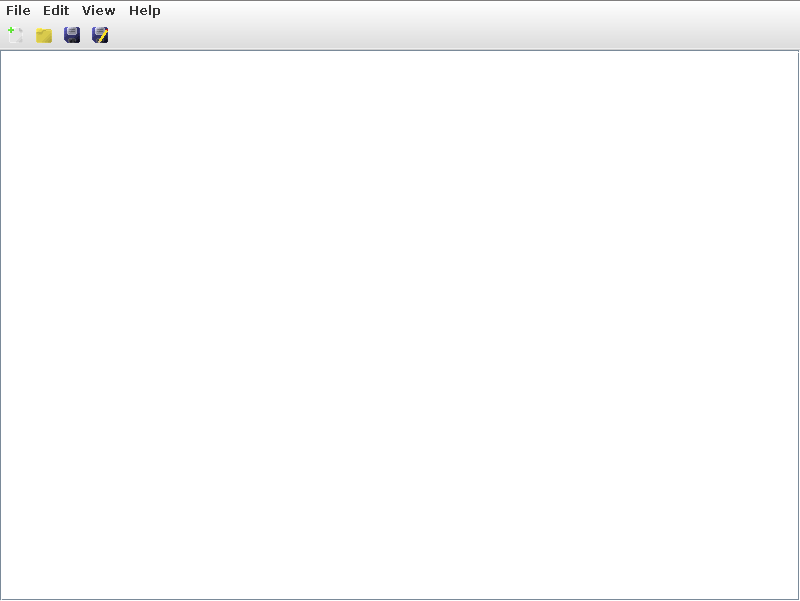

# writxtr
Simple java text editor

## Building

Build the jar containing the executable and resources with `./gradlew jar`. The jar will be placed in `build/libs/writxtr.jar`

## Running
`java -jar build/libs/writxtr.jar`
